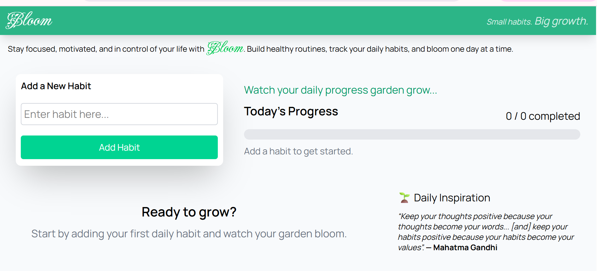
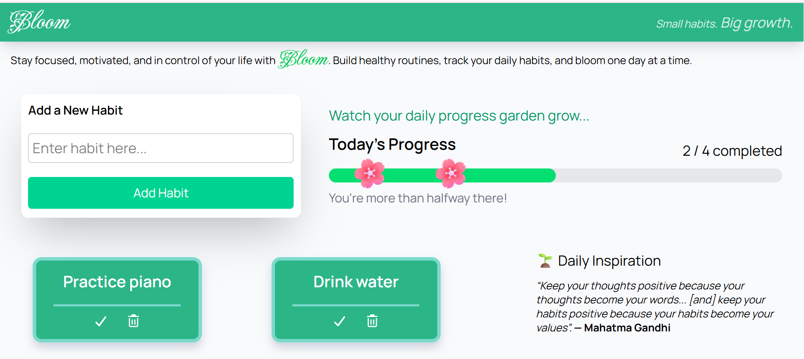
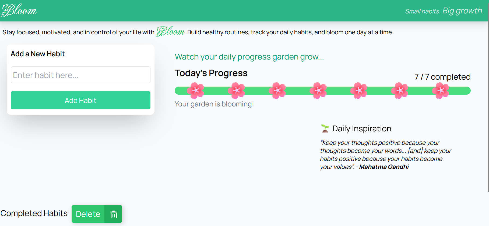
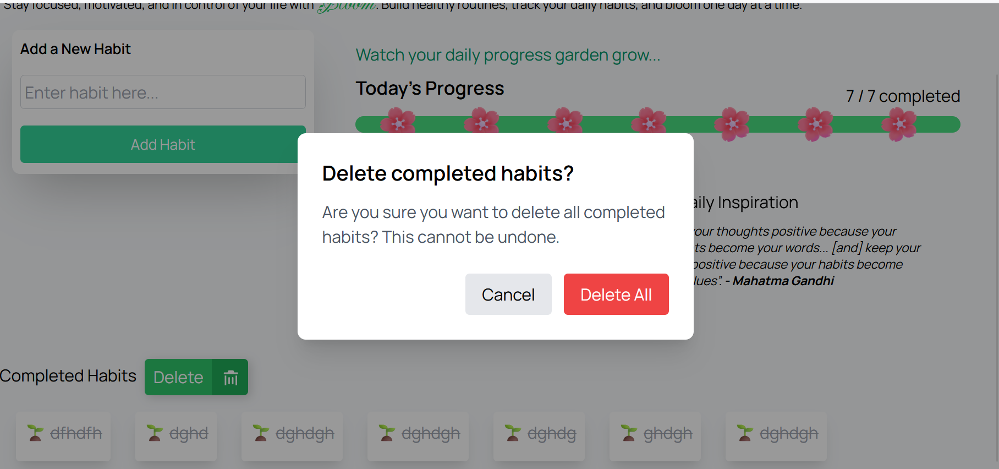

# Bloom — Daily Habit Tracker

A simple daily habit tracker that helps users build consistency, visualize their progress, and grow positive routines one habit at a time.

---

## Live Demo

[View my project here.](https://kendrahartnett.github.io/daily-habit-tracker/)

---

## The Problem

Many people struggle to stay consistent with healthy habits. Without an easy way to visualize progress, it is difficult to stay motivated over time.

---

## The Value

What Bloom Helps Users Do:

    - Build positive, healthy routines.
    - Develop consistency.
    - Stay accountable.
    - Visualize daily progress.
    - Stay motivated through simple progress tracking.

---

## Project Plan

🌱 Add a daily habit → Complete it → Watch your garden grow.

I built Bloom as a simple daily habit tracker designed to help users
stay consistent with their habits and visualize their progress.

I began by defining the Minimum Viable Product (MVP) and creating a
Markdown planning document to organize project requirements, features,
and development steps. Breaking the project into smaller milestones
helped me stay focused and track progress throughout development.

Next, I set up the project structure and repository. Then I
created the initial user interface with HTML and CSS. I added the core
functionality using JavaScript, allowing users to create, read, update
(mark habits as complete), and delete habits.

I chose to use localStorage for data persistence between browser sessions
without requiring a backend. After completing the MVP, I refined the
user experience and visual design by adding a progress bar, progress
garden, completion animation, daily reset functionality, and
confirmation feedback for deleting completed habits.

---

## Features

- Full CRUD operations:
  - Create a new habit
  - Read and display saved habits
  - Update a habit by marking it complete
  - Delete individual habits
  - Delete all completed habits
- localStorage persistence between browser sessions
- Empty-state messaging for new users
- Input validation for empty habits
- Enter-key support for adding habits
- Daily habit reset
- Daily progress bar
- Progress garden that grows as habits are completed
- Habit completion animation
- Delete confirmation modal
- Toast notifications for user feedback
- Responsive web design

---

## Stretch Features

Future enhancements could include:

- Habit streak tracking
- Weekly and monthly statistics
- Calendar view
- Habit categories
- Achievement badges
- Reminders
- Habit priorities
- Dark mode

---

## Technologies Used

- HTML
- CSS
- JavaScript
- localStorage
- Tailwind CSS
- Git
- GitHub
- Visual Studio Code

---

## AI Tools Used

I used AI tools as development assistants throughout the project for
debugging, brainstorming, code explanations, UI/UX ideas, and
documentation support.

- ChatGPT
- Codex
- Gemini

## Running the Project

Clone the repository:

```bash
git clone https://github.com/kendrahartnett/daily-habit-tracker.git
```

Open the project folder:

```bash
cd daily-habit-tracker
```

Open `index.html` in your browser.

Or, if using VS Code:

1. Install the Live Server extension.
2. Right-click `index.html`.
3. Select **Open with Live Server**

---

## Screenshots









---

## Author

**Kendra Hartnett**

Full Stack Web Developer

GitHub: [github.com/kendrahartnett](https://github.com/kendrahartnett)

---
