# AI Prompt History

## Overview

Throughout the development of Bloom, I used AI tools as a development aid to help me plan, troubleshoot, understand, and iterate on my project. AI served as a support tool rather than a replacement for my own development process. I used it to ask questions, explore possible solutions, debug errors, and verify that features were working as intended.

My prompt history demonstrates several stages of the development process:

- **Planning:** I used prompts to establish the project structure, determine an appropriate MVP, plan GitHub branching practices, and break larger features into smaller tasks.
- **Curiosity and Learning:** I asked questions about JavaScript concepts, HTML structure, localStorage, Git/GitHub workflows, and how different pieces of code worked so I could better understand the implementation.
- **Iteration:** As Bloom developed, I used AI to brainstorm improvements, refine the UI, and determine which features would provide the most value while keeping the project within scope.
- **Debugging:** When features did not work as expected, I provided error messages, screenshots, and relevant code and used AI to help identify the source of the problem and determine possible fixes.
- **Verification and Testing:** I used prompts to troubleshoot completed features, test expected behavior, identify edge cases, and confirm that changes worked before moving on to the next feature.

The following screenshots provide examples of this process throughout the development of Bloom.

---

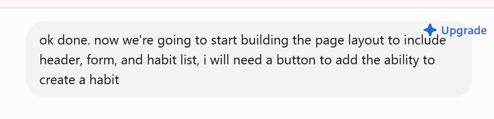

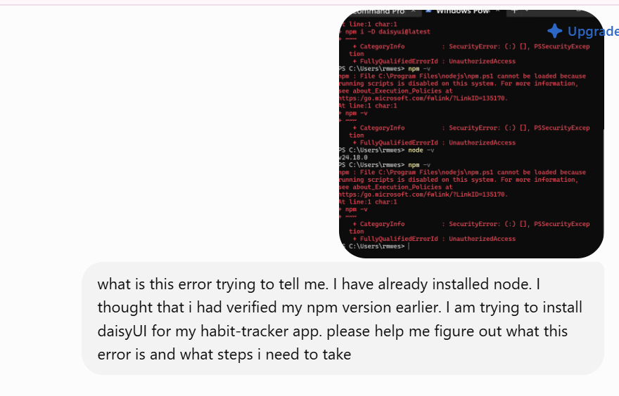

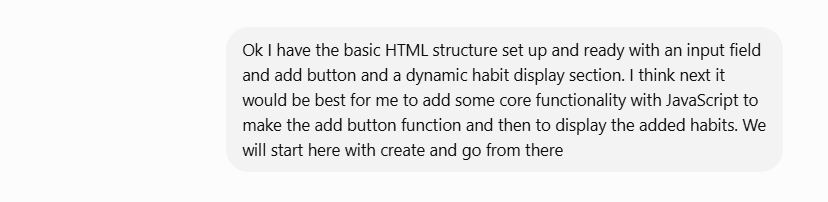

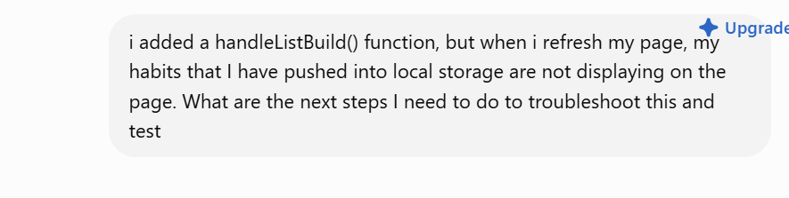

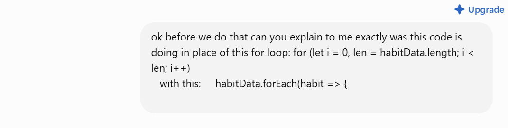

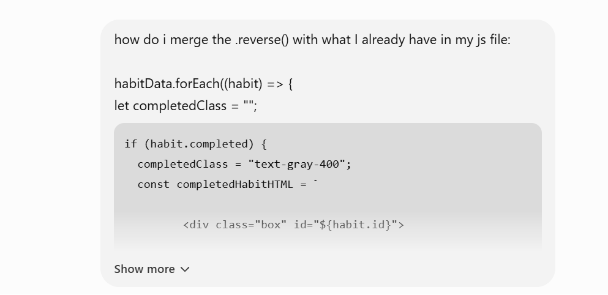

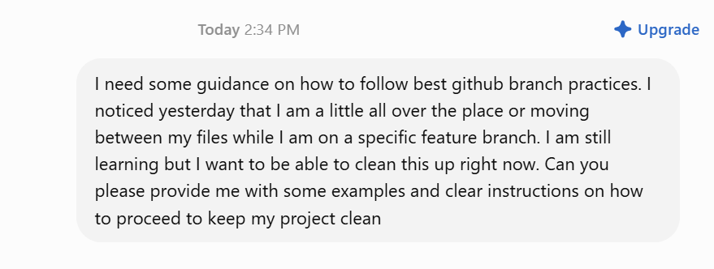

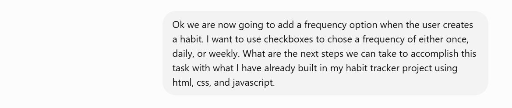

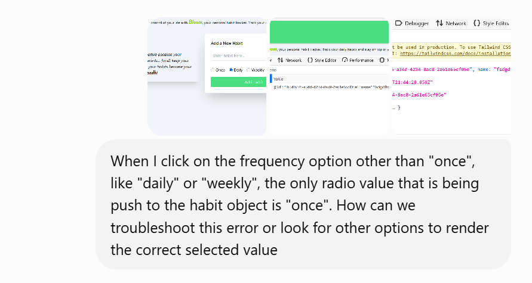

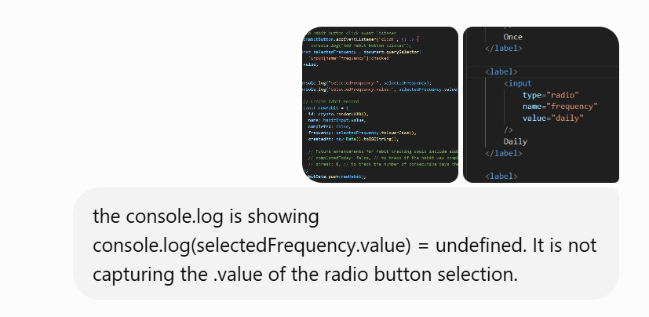

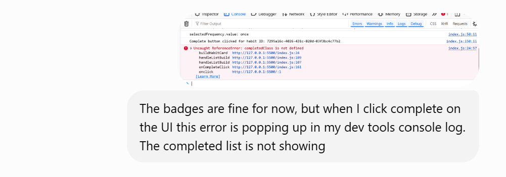

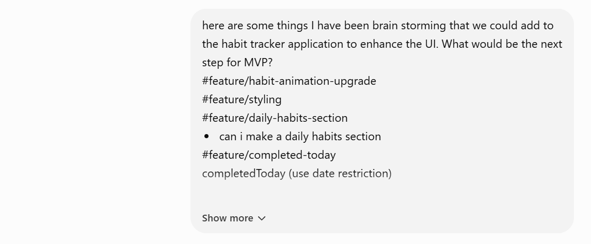

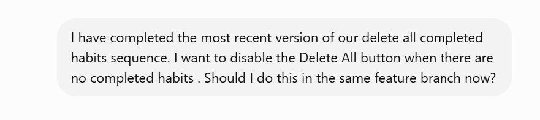

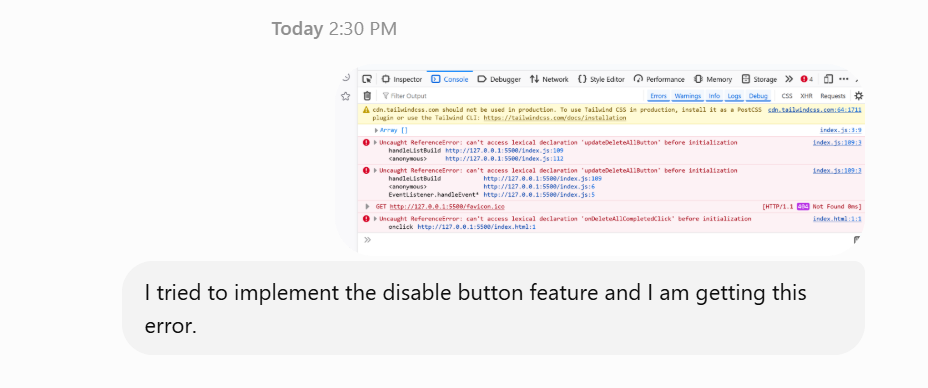

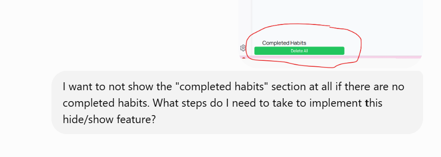

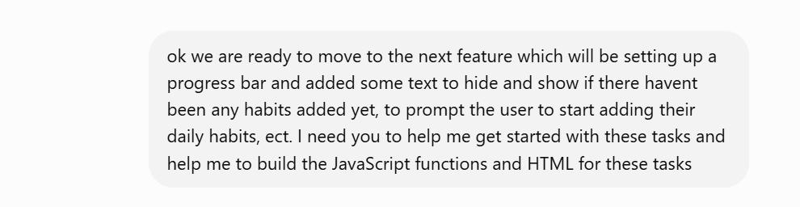

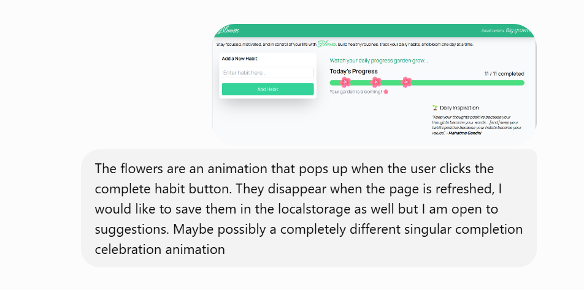

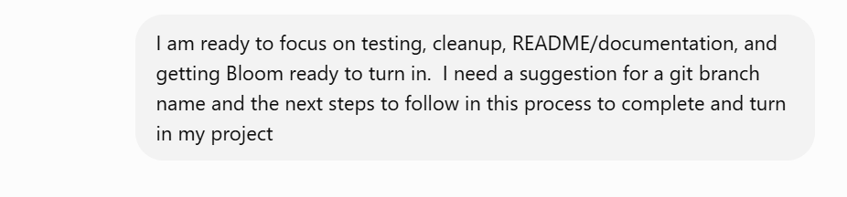

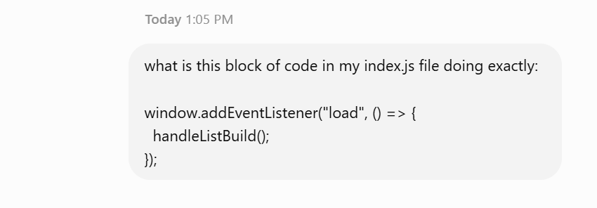

---

## Development Evidence

The screenshots above represent selected examples from my AI-assisted development process. They demonstrate how I used AI to plan, learn, iterate, debug, and verify features while maintaining responsibility for the implementation and final decisions.
